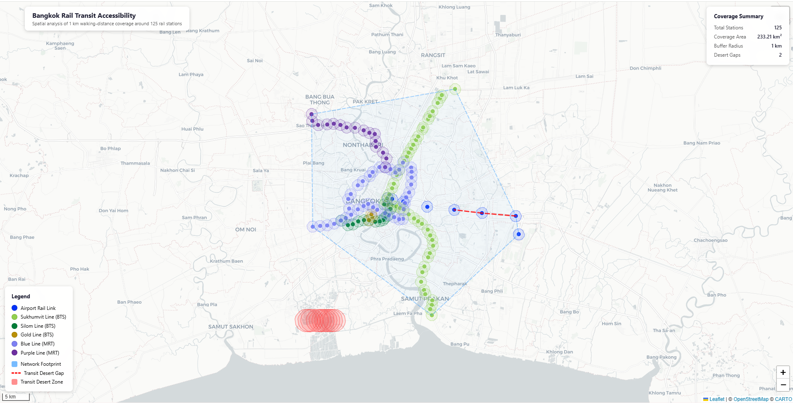

# Bangkok Rail Transit Accessibility Analysis

Spatial analysis of Bangkok's rail transit network, measuring walkable coverage and identifying transit deserts across the metropolitan area.



## Key Findings

| Metric | Value |
|---|---|
| Stations analysed | 125 |
| Coverage area (1 km buffer) | 233.21 km² |
| Buffer radius | 1.0 km (~10-15 min walk) |
| Transit desert gaps (> 5 km) | 2 |

**Transit desert gaps identified:**

- Airport Rail Link: Lat Krabang to Ban Thap Chang (6.08 km)
- Airport Rail Link: Ban Thap Chang to Hua Mak (5.02 km)

## Rail Lines Covered

| Line | Service | Colour |
|---|---|---|
| Airport Rail Link | AIRPORTLINK | #0332F8 |
| Sukhumvit Line | BTS | #92D04E |
| Silom Line | BTS | #007D38 |
| Gold Line | BTS | #BA9006 |
| Blue Line | MRT | #7D80F3 |
| Purple Line | MRT | #6D2EA0 |

## Project Structure

```
bangkok-transit-accessibility-analysis/
├── index.html            # Interactive web map (Leaflet.js)
├── spatial_analysis.py   # Analysis script (generates coverage.geojson)
├── coverage.geojson      # Output: station buffers, gaps, footprint
├── README.md
├── LICENSE
└── .gitignore
```

## Interactive Web Map

The `index.html` file provides a browser-based map with:

- **Station markers** coloured by rail line with popups showing name, Thai name, line, and station ID
- **1 km buffer polygons** visualising the walkable catchment around each station
- **Network footprint** (convex hull of all stations)
- **Transit desert gaps** shown as dashed red lines between distant consecutive stations
- **Transit desert zones** highlighting areas far from any station
- **Layer controls** to toggle each data layer independently
- **Three basemaps**: Light, Dark, and Satellite

### Viewing the Map

Because the page loads `coverage.geojson` via `fetch()`, it must be served over HTTP. Open a terminal in the project directory and run:

```bash
# Python 3
python -m http.server 8000

# Then open http://localhost:8000 in your browser
```

Alternatively, use any static file server (VS Code Live Server, `npx serve`, etc.).

## Methodology

### 1. Station Buffers

A 1 km circular buffer is computed around each of the 125 stations. At Bangkok's latitude (~13.7°N), the degree-to-kilometre conversion factors are:

- 1° latitude ≈ 110.574 km
- 1° longitude ≈ 107.551 km

Each buffer is approximated as a 64-point polygon.

### 2. Coverage Estimation

Total transit coverage area is estimated using a grid-sampling approach:

1. A bounding box is computed around all station buffers.
2. The box is divided into 100 m × 100 m cells.
3. Each cell is tested for intersection with any station buffer.
4. Covered cell count × cell area = total coverage (233.21 km²).

This avoids requiring heavy GIS dependencies while remaining accurate to ~1%.

### 3. Transit Desert Detection

**Intra-line gaps:** Consecutive stations on the same line branch are checked. Pairs separated by more than 5 km are flagged as transit deserts.

**Isolated zones:** The grid is re-sampled at 500 m resolution to find cells more than 5 km from the nearest station. The 10 most isolated locations are reported.

### 4. Network Footprint

A convex hull is computed over all station positions using Andrew's monotone chain algorithm to represent the network's spatial extent.

## Running the Analysis

### Prerequisites

- Python 3.8+
- Station data CSV at `dist/data.csv` (columns: `stationId`, `name`, `nameEng`, `geoLat`, `geoLng`, `lineNameEng`, `lineColorHex`, `lineServiceName`)

### Execution

```bash
python spatial_analysis.py
```

This reads the station data, performs the spatial analysis, prints a summary to the console, and writes `coverage.geojson`.

### Dependencies

The script uses only Python standard library modules (`json`, `math`, `csv`, `os`, `re`, `collections`). No external packages are required.

## GeoJSON Schema

The output `coverage.geojson` is a standard GeoJSON `FeatureCollection` with the following feature types:

| `properties.type` | Geometry | Description |
|---|---|---|
| `station` | Point | Station location with name, line, colour |
| `buffer_1km` | Polygon | 1 km walkable catchment area |
| `network_footprint` | Polygon | Convex hull of all stations |
| `transit_desert_gap` | LineString | Gap > 5 km between consecutive stations |
| `transit_desert_zone` | Polygon | Area > 5 km from any station |

### Metadata

The `FeatureCollection` includes a top-level `metadata` object:

```json
{
  "title": "Bangkok Rail Network - Spatial Accessibility Analysis",
  "transit_coverage_sqkm": 233.21,
  "total_stations": 125,
  "buffer_radius_km": 1.0,
  "gap_threshold_km": 5.0,
  "transit_desert_gaps": [...]
}
```

## TOD Planning Recommendations

Based on the analysis, key Transit-Oriented Development recommendations include:

1. **High-priority TOD zones** within 1 km buffers — ideal for mixed-use, high-density zoning with FAR bonuses near stations
2. **Addressing transit deserts** through feeder bus/BRT routes, future line extensions, and bike-share/last-mile mobility hubs
3. **Density gradients** — highest FAR within 500 m of stations, tapering to medium density at the 1 km boundary
4. **Walkability improvements** — safe sidewalks, covered walkways, and wayfinding signage to maximise the 1 km catchment
5. **Equity safeguards** — affordable-housing quotas (20-30%) in new developments within station buffer areas

## License

This project is licensed under the [MIT License](LICENSE).
